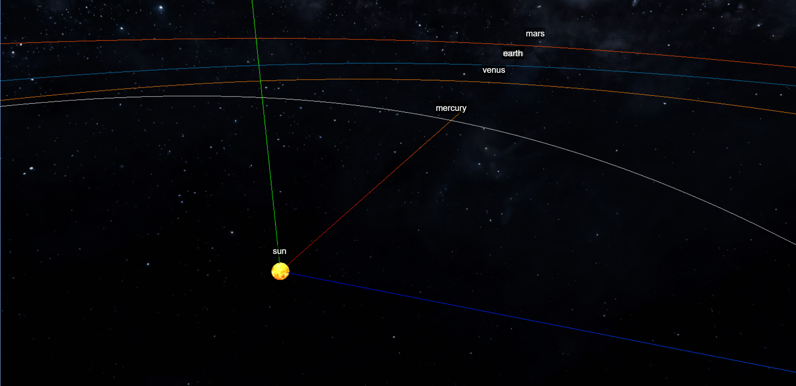
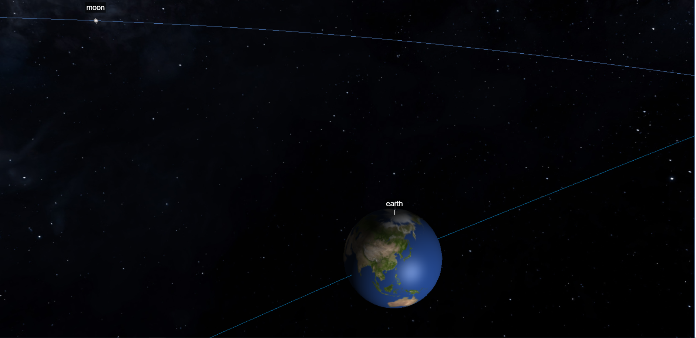

# 3D Solar system using three.js

This is an attempt to make a 3d solar system using three.js.

# TODO

- [x] Make the sun shine
- [x] Add inner planets
- [x] Make the earth tilt [Like this][2]
- [x] Ellipse orbital paths inclination
- [x] Show earth axis
- [x] The moon
- [x] Marker, or labels for the planets
- [x] Better orbit tool
- [x] Y is up, z is in/out, change it everywhere
- [x] Color planet orbits
- [x] Stars
- [x] Make planets rotate
- [x] Make planets revolve around sun
- [x] Make moons revolve around planets
- [x] GUI controls
- [x] GUI play/pause
- [x] GUI Show / Set Date and time
- [x] GUI lock on planet
- [ ] Outer planets
- [ ] Outer planets moons
- [ ] Outer planets rings
- [ ] Simulate planet positions according to [Nasa document][1]

### References

[1]: <https://ssd.jpl.nasa.gov/txt/aprx_pos_planets.pdf> "Approximation of planet positions"
[2]: <https://codepen.io/simonshack/pen/drQOLp> "Codepen for solar system"

* [Three js](https://threejs.org/)
* [Solar system information](https://ssd.jpl.nasa.gov/horizons.cgi?s_target=1#top)
* [Approximation of planet positions][1]
* [Implementation of the above](https://gist.github.com/robbykraft/7578514)
* [Textures](https://www.solarsystemscope.com/textures/)
